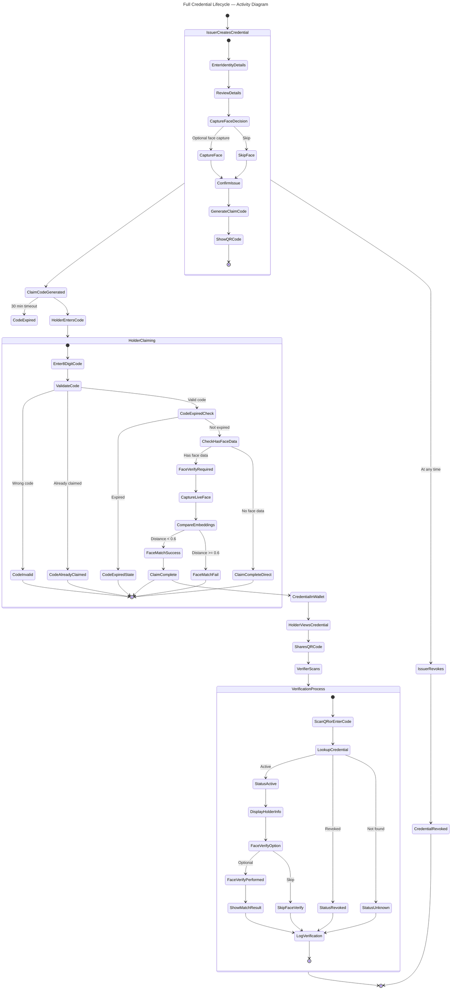
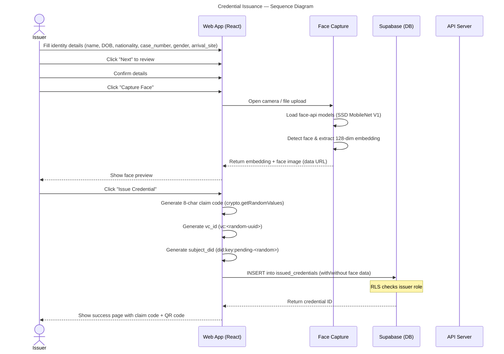
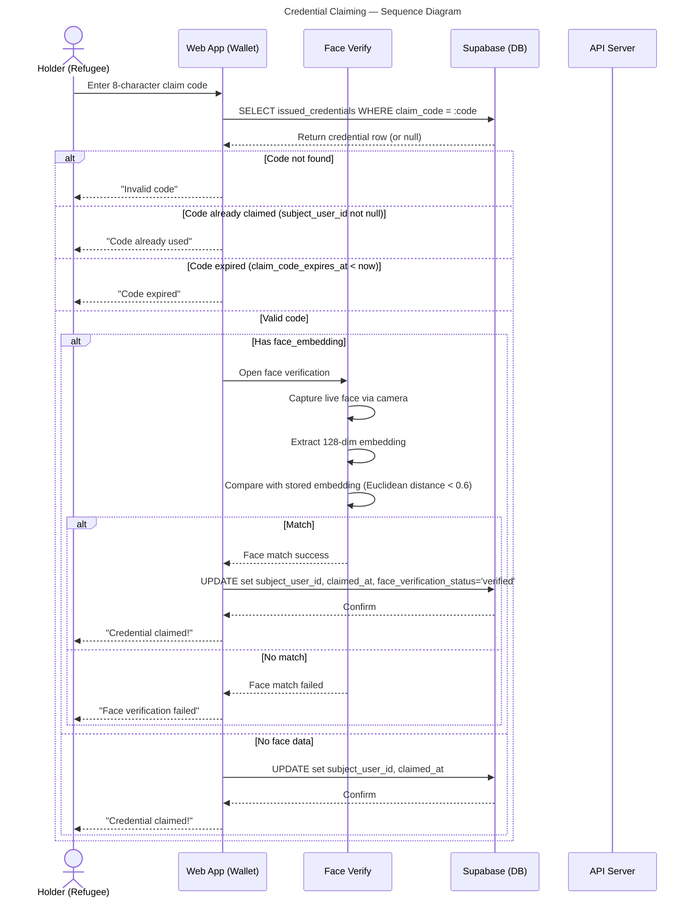
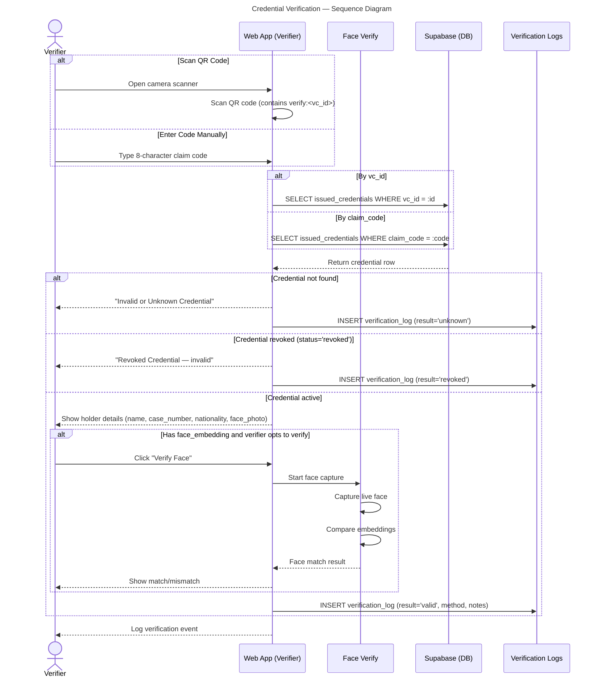
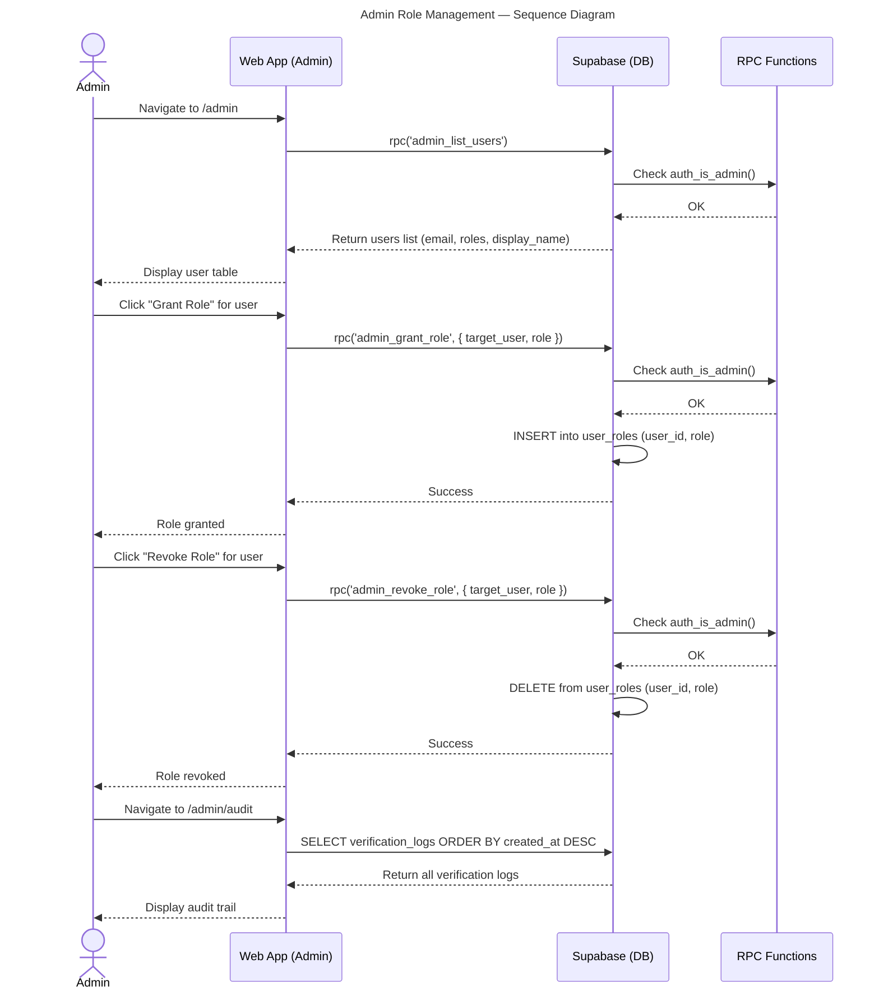
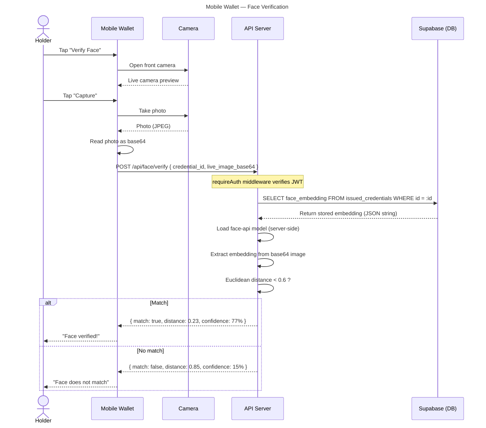
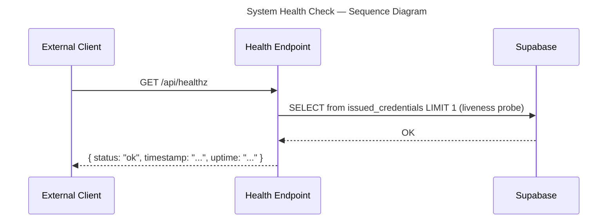
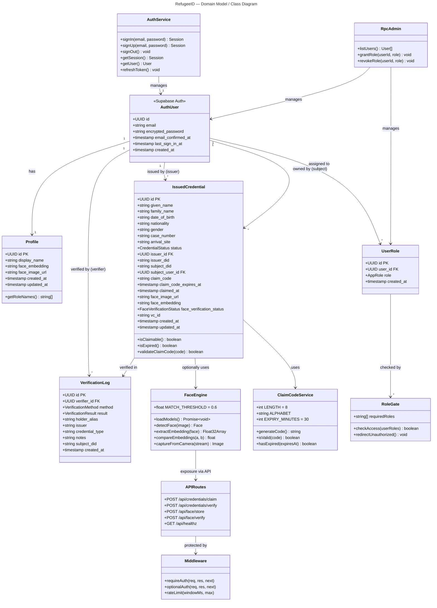

# RefugeeID — System Documentation

> A decentralized identity infrastructure for refugees and displaced persons using W3C Verifiable Credentials. Four separate portals — Holder Wallet, Issuer Portal, Verifier Console, Admin Panel — each with its own login, UX, and color system, all sharing a Supabase backend.

---

## Table of Contents

- [1. Overview](#1-overview)
- [2. System Architecture](#2-system-architecture)
- [3. Technology Stack](#3-technology-stack)
- [4. Portals & Features](#4-portals--features)
- [5. Data Model](#5-data-model)
- [6. Authentication & Authorization](#6-authentication--authorization)
- [7. Credential Lifecycle](#7-credential-lifecycle)
- [8. Face Verification System](#8-face-verification-system)
- [9. API Server](#9-api-server)
- [10. Security](#10-security)
- [11. Mobile Wallet](#11-mobile-wallet)
- [12. Deployment](#12-deployment)
- [13. Development](#13-development)

---

## 1. Overview

RefugeeID is a **self-sovereign identity platform** built for refugees and displaced persons. It allows:

- **Holders** (refugees) to claim, store, and share verifiable credentials
- **Issuers** (UNHCR/NGO staff) to create and issue credentials with optional face biometrics
- **Verifiers** (banks, schools, border control) to verify credential authenticity
- **Admins** to manage users and roles across the platform

The system is built as a **pnpm monorepo** with a shared database schema, OpenAPI specification, and generated client libraries.

---

## 2. System Architecture

```
┌─────────────────────────────────────────────────────────────────────┐
│                        Supabase (Backend as a Service)               │
│  ┌──────────────┐  ┌──────────────────┐  ┌──────────────────────┐  │
│  │ Auth         │  │ PostgreSQL (RLS)  │  │ Storage              │  │
│  │ (email/pass) │  │                  │  │ (face images, etc)   │  │
│  │ JWT tokens   │  │ issued_credentials│  │                      │  │
│  │              │  │ profiles          │  │                      │  │
│  │              │  │ user_roles        │  │                      │  │
│  │              │  │ verification_logs │  │                      │  │
│  └──────┬───────┘  └────────┬─────────┘  └──────────┬───────────┘  │
└─────────┼───────────────────┼───────────────────────┼──────────────┘
          │                   │                       │
          ▼                   ▼                       ▼
┌─────────────────────┐  ┌─────────────────────┐  ┌──────────────────┐
│ Web Frontend        │  │ Mobile Wallet       │  │ API Server       │
│ (React + Vite)      │  │ (Expo / RN)         │  │ (Express 5)      │
│                     │  │                     │  │                  │
│ /wallet  (Holder)   │  │ Auth: Supabase      │  │ POST /face/store │
│ /issuer  (Issuer)   │  │ Storage: SecureStore │  │ POST /face/verify│
│ /verifier(Verifier) │  │ Camera: expo-camera  │  │ POST /creds/claim│
│ /admin   (Admin)    │  │ Biometrics: local-auth│  │ POST /creds/verify
│                     │  │ QR: rn-qrcode-svg    │  │ GET  /healthz    │
│ Auth: Supabase anon │  │ Offline: AsyncStorage│  │                  │
│ Sessions: localStorage│  │                     │  │ Auth: Bearer JWT │
└─────────────────────┘  └─────────────────────┘  └──────────────────┘
                                                     │
                                                     ▼
                                          ┌─────────────────────┐
                                          │ Shared Libraries     │
                                          │ (lib/*)              │
                                          │                      │
                                          │ @workspace/db        │
                                          │  - Drizzle schema     │
                                          │  - Enums, types       │
                                          │                      │
                                          │ @workspace/api-zod   │
                                          │  - Zod schemas       │
                                          │   (from OpenAPI)     │
                                          │                      │
                                          │ @workspace/api-      │
                                          │ client-react         │
                                          │  - React Query hooks │
                                          │  - Fetch client       │
                                          │                      │
                                          │ @workspace/api-spec  │
                                          │  - OpenAPI 3.1 spec  │
                                          │  - Orval codegen     │
                                          └─────────────────────┘
```

### Architecture Decisions

- **Supabase-direct frontend**: All data access goes through Supabase via the anon key with Row-Level Security (RLS). No custom Express routes for frontend CRUD.
- **4 isolated portals, 1 artifact**: Each portal is a separate UX within one React app — different layout, color system, and navigation — sharing only auth context and the Supabase client.
- **Role-based access**: Supabase RLS + `user_roles` table controls access. A `<RoleGate>` component redirects unauthorized users.
- **Anon key only**: The frontend uses the Supabase anon key (public, safe for browsers). Admin operations (grant/revoke roles) go through Supabase RPC functions with server-side RLS checks.
- **API Server for privileged ops**: The Express backend uses the Supabase Service Role Key for operations that require elevated privileges (credential claiming with face verification, storing face embeddings).

---

## 3. Technology Stack

### Languages & Runtime
| Component | Language | Runtime |
|-----------|----------|---------|
| Web Frontend | TypeScript 5.9 (strict) | Browser (Node.js 24 for dev) |
| Mobile Wallet | TypeScript 5.9 (strict) | React Native 0.76 / Expo SDK 52 |
| API Server | TypeScript 5.9 (strict) | Node.js 24 |
| Database | SQL | PostgreSQL (via Supabase) |

### Frontend (Web)
| Library | Version | Purpose |
|---------|---------|---------|
| React | 19.x | UI framework |
| Vite | 7.x | Build tool |
| wouter | ~3.x | Lightweight routing |
| Tailwind CSS | 4.x | Utility-first CSS |
| shadcn/ui | latest | 55+ Radix-based components |
| framer-motion | latest | Page/component animations |
| TanStack React Query | 5.x | Server-state management |
| react-hook-form + zod | latest | Form validation |
| qrcode.react | latest | QR code rendering |
| html5-qrcode | latest | QR code scanning |
| @vladmandic/face-api | latest | Face detection (browser) |
| lucide-react | latest | Icons |

### Frontend (Mobile)
| Library | Version | Purpose |
|---------|---------|---------|
| React Native | 0.76.6 | Mobile framework |
| Expo SDK | 52 | Managed native modules |
| React Navigation | 7.x | Navigation (stack + tabs) |
| expo-camera | latest | QR scanning, face capture |
| expo-secure-store | latest | Encrypted token storage |
| expo-local-authentication | latest | Biometric auth |
| @react-native-async-storage | latest | Offline credential cache |
| react-native-qrcode-svg | latest | QR code generation |
| @supabase/supabase-js | latest | Supabase client |

### Backend
| Library | Version | Purpose |
|---------|---------|---------|
| Express | 5.x | HTTP server |
| Drizzle ORM | latest | Database schema & queries |
| @vladmandic/face-api | latest | Server-side face recognition |
| canvas (node) | latest | HTML canvas for face-api |
| pino | latest | Structured logging |
| esbuild | latest | TypeScript bundler |
| Supabase Admin SDK | latest | JWT verification, privileged DB |

### Shared Libraries
| Package | Purpose |
|---------|---------|
| `@workspace/db` | Drizzle ORM schema + enums for PostgreSQL |
| `@workspace/api-spec` | OpenAPI 3.1 specification |
| `@workspace/api-zod` | Zod schemas generated from OpenAPI spec |
| `@workspace/api-client-react` | TanStack React Query hooks + fetch client |

---

## 4. Portals & Interfaces

The RefugeeID system provides four distinct web portals, each tailored to a specific user role. Every portal shares the same Supabase backend and auth context, but each has its own layout, navigation, color scheme, and feature set. Below is a detailed breakdown of each interface, its purpose, layout, screens, and user interaction flow.

---

### 4.1 Holder Wallet (`/wallet`)

**Purpose:** A mobile-first web wallet that lets refugees claim, view, store, and share their digital identity credentials. Designed as a primary interface for displaced persons with accessibility in mind.

#### Layout & Navigation

The Holder Wallet uses a `WalletLayout` with a fixed bottom tab bar containing three tabs: **Home**, **Recover**, and **Settings**. The layout is optimized for mobile screens with a sticky header, rounded containers, and gesture-friendly touch targets.

```
┌─────────────────────────────────────┐
│  ┌─────────────────────────────┐    │
│  │  RefugeeID Wallet           │    │
│  │  ● Verified Identity        │    │  ← Gradient header card
│  │  [Holder Name]              │    │
│  │  did:key:z6M...xxxx         │    │
│  │                             │    │
│  │  [Share ID]  [Claim]        │    │  ← Action buttons
│  └─────────────────────────────┘    │
│                                     │
│  ┌─────────────────────────────┐    │
│  │  My Credentials      2 items│    │
│  │                             │    │
│  │  ┌─────────────────────┐   │    │
│  │  │[face] John Doe      │   │    │  ← Credential cards
│  │  │       UNHCR • Case  │ ✓ │    │    (tappable → detail)
│  │  └─────────────────────┘   │    │
│  │                             │    │
│  │  ┌─────────────────────┐   │    │
│  │  │[face] Jane Doe      │   │    │
│  │  │       UNHCR • Case  │ ✓ │    │
│  │  └─────────────────────┘   │    │
│  └─────────────────────────────┘    │
│                                     │
│  ───────┬──────────┬───────────     │  ← Bottom tabs
│  Home   │ Recover  │ Settings       │
│  ───────┴──────────┴───────────     │
└─────────────────────────────────────┘
```

**Color scheme:** Dark blue/indigo gradients with amber accents. Dark mode toggle available.

#### Screen-by-Screen Breakdown

**Screen: Wallet Home (`/wallet`)**

| Element | Type | Purpose |
|---------|------|---------|
| Header card | Gradient container | Displays holder name, DID, and verified identity badge |
| Share ID button | Button | Opens QR code dialog containing the holder's DID, with Copy DID and Share via Wallet options |
| Claim button | Button | Opens claim dialog for entering an 8-character claim code |
| Credential list | Interactive list | Shows all claimed credentials with face thumbnail, name, case number, status indicator |
| Empty state | Placeholder | When no credentials exist: shows icon + "No credentials yet. Claim one using the button above." |
| Loading skeleton | Animated placeholder | Three pulsing rectangles shown while credentials load |

**Screen: Claim Credential (Dialog/Modal)**

| Element | Type | Purpose |
|---------|------|---------|
| Title | Text | "Claim Credential" |
| Instruction text | Text | Explains the claim code process |
| Code input | Text input (centered, monospace, uppercase) | 8-character code entry with auto-uppercase |
| Verify Code button | Button | Validates code via Supabase query (checks not claimed, not expired) |
| Face verification notice | Alert box | (Conditional) Shows amber warning when credential has face data and verification is required |
| FaceVerify component | Embedded component | (Conditional) Runs live face capture and compares embedding against the stored one |

**Screen: Credential Detail (`/wallet/credential/:id`)**

| Element | Type | Purpose |
|---------|------|---------|
| Back button | Icon button | Returns to wallet home |
| Title | Text | "Credential Details" |
| Credential card | Gradient card | Shows issuer (UNHCR), face photo, holder name, nationality, gender |
| Revoked overlay | Overlay with "Revoked" badge | (Conditional) Red diagonal banner over the card if credential is revoked |
| Identity Photo section | Card with image + status badge | Shows the face image captured at issuance, with verification status (Verified/Pending/Failed) |
| Private Data section | Card with toggle reveal | Date of Birth, Case Number, Arrival Site — hidden behind "Reveal" button (masked by default) |
| Verification QR section | Card with QR code | Displays QR encoding `verify:<vc_id>` scannable by verifiers |
| Revoked badge | Red badge | (Conditional) Shown when credential is revoked |

**Screen: Recover ID (`/wallet/recover`)**

| Element | Type | Purpose |
|---------|------|---------|
| Step indicator | Progress bar | Three-step flow: Code Entry → Face Verify (if needed) → Complete |
| Code input | Text input | 8-character code entry (auto-uppercase) |
| Claim via API button | Button | Sends claim request to `POST /api/credentials/claim` (API server) |
| FaceVerify component | Embedded component | (Conditional) If credential has face data, runs live verification before claiming |
| Success/error toast | Toast notification | Shows result of claim attempt |

**Screen: Settings (`/wallet/settings`)**

| Element | Type | Purpose |
|---------|------|---------|
| Dark mode toggle | Switch | Toggles dark/light theme (persisted to localStorage) |
| Font size selector | Radio group | Normal / Large / Extra Large |
| Language selector | Radio group | 12 languages including English, Arabic, French, Swahili, Somali, Amharic, Tigrinya, Turkish, Pashto, Dari, Urdu, Spanish (uses Google Translate widget) |
| Erase Wallet button | Button (red) | Removes all credentials from this wallet by setting `subject_user_id` to null |
| Sign Out button | Button | Signs out via Supabase Auth and redirects to home |

#### Key Components Used

| Component | File | Role |
|-----------|------|------|
| `WalletLayout` | `components/WalletLayout.tsx` | Provides bottom tab navigation and mobile-optimized container |
| `FaceVerify` | `components/FaceVerify.tsx` | Captures live face via camera, compares embedding against stored embedding using Euclidean distance (threshold < 0.6) |
| `FaceCapture` | `components/FaceCapture.tsx` | Dual-mode (camera / upload photo) face capture for embedding extraction |

#### Data Flow

```
1. Mount → supabase.from('issued_credentials').select('*')
              .eq('subject_user_id', user.id)
              .order('claimed_at', { ascending: false })

2. Claim → supabase.from('issued_credentials').select('*')
              .eq('claim_code', code)
              .is('subject_user_id', null)
              .gt('claim_code_expires_at', now)
              .maybeSingle()
         → If has face_embedding: open FaceVerify
         → supabase.from('issued_credentials').update({ subject_user_id, claimed_at })

3. Recover (API) → POST /api/credentials/claim { claim_code, user_id, face_embedding? }

4. Settings → localStorage for prefs, supabase.auth.signOut() for logout
```

---

### 4.2 Issuer Portal (`/issuer`)

**Purpose:** Desktop console for UNHCR officers and NGO staff to create verifiable credentials for refugees with an optional face biometric enrollment step. Also provides credential management (listing, revocation) and trust registry views.

#### Layout & Navigation

The Issuer Portal uses a `PortalLayout` with a fixed sidebar containing three navigation items and a responsive content area. The layout is desktop-optimized with a wide container.

```
┌──────────────┬──────────────────────────────────────┐
│  Sidebar     │  Content Area                        │
│              │                                      │
│  ◉ Issue     │  Issue New Credential                │
│    Credential│  ────────────────────────────────     │
│              │  [1]  [2]  [3]  [4]  [5]            │  ← Step indicator
│  ○ Creds     │                                      │
│    Issued    │  ┌───────────────────────────────┐   │
│              │  │ Identity Details              │   │
│  ○ Trust     │  │                               │   │
│    Registry  │  │ Given Name   [____________]   │   │
│              │  │ Family Name  [____________]   │   │
│              │  │ DOB          [________]       │   │
│              │  │ Nationality  [____________]   │   │
│              │  │ Gender       [▼ Select  ]     │   │
│              │  │ Case Number  [____________]   │   │
│              │  │ Arrival Site [____________]   │   │
│              │  │                               │   │
│              │  │         [Review Details]      │   │
│              │  └───────────────────────────────┘   │
│              │                                      │
└──────────────┴──────────────────────────────────────┘
```

**Color scheme:** Amber/warm tones (`text-amber-500` accent) with clean white cards and slate gray text.

#### Sidebar Navigation

| Item | Icon | Route | Description |
|------|------|-------|-------------|
| Issue Credential | FilePlus | `/issuer` | Active by default — the 5-step issuance wizard |
| Credentials Issued | List | `/issuer/list` | Table of all credentials issued by this user |
| Trust Registry | Shield | `/issuer/trust` | Static list of trusted DID anchors |

#### Screen-by-Screen Breakdown

**Screen: Issue Credential (`/issuer`) — 5-Step Wizard**

The issuance wizard uses a `step` state variable (1–5) with a horizontal progress bar showing 5 numbered circles. The progress bar fills with amber color as the user advances.

**Step 1: Identity Details**

| Element | Type | Purpose |
|---------|------|---------|
| Form fields (7) | Input / Select | given_name, family_name, date_of_birth (date picker), nationality (text), gender (Select with 4 options), case_number, arrival_site |
| Review Details button | Button | Validates required fields (given_name, family_name, case_number) and advances to step 2 |

**Step 2: Review Details**

| Element | Type | Purpose |
|---------|------|---------|
| Data display | Read-only grid | Shows all 7 fields from step 1 in a `bg-slate-50` panel |
| Back to Edit button | Button | Returns to step 1 (form data preserved) |
| Next: Capture Face button | Button | Advances to step 3 |

**Step 3: Capture Beneficiary Face**

| Element | Type | Purpose |
|---------|------|---------|
| Instruction text | Text | "Take a photo of the beneficiary. This face image will be linked to their credential..." |
| FaceCapture component | Embedded component | The `FaceCapture` component with two tabs: **Camera** (live browser camera) and **Upload Photo** (file picker for PNG/JPEG/WebP). On capture, runs `detectAndExtractEmbedding` using face-api (SSD MobileNet V1). If face detected: shows preview with green confirmation + "Use This Photo" button. If no face: shows error message |
| Cancel button | Button | Returns to step 2 |

**Step 4: Confirm Face & Issue**

| Element | Type | Purpose |
|---------|------|---------|
| Face thumbnail | Image | Shows the captured face photo |
| Holder name | Text | `{given_name} {family_name}` |
| Success badge | Alert box | "Face captured successfully. Embedding stored." (green) |
| Explanation text | Text | "When the beneficiary claims this credential, they will need to verify their face matches." |
| Retake Photo button | Button | Returns to step 3 to recapture |
| Confirm & Issue button | Button | Inserts credential into Supabase with `claim_code` (8-char, `crypto.getRandomValues()`), `vc_id`, `subject_did`, optional `face_embedding`, 30-minute `claim_code_expires_at`. Shows loading state while issuing |

**Step 5: Success**

| Element | Type | Purpose |
|---------|------|---------|
| Check icon | Large icon | Green checkmark in a circle |
| Title | Text | "Credential Issued" |
| Description | Text | "Provide this code to the beneficiary so they can claim it in their wallet." |
| Face link badge | Card | (Conditional) Shows face thumbnail + "Face linked to credential" / "Holder must verify face when claiming" if face was captured |
| Claim Code display | Large monospace code | 8-character code displayed at `text-4xl font-mono tracking-[0.2em]` with a Copy button |
| QR Code | SVG QR code | QR encoding of the claim code value |
| Issue Another button | Button | Resets all form state and returns to step 1 |

**Screen: Credentials Issued (`/issuer/list`)**

| Element | Type | Purpose |
|---------|------|---------|
| Search input | Text input with search icon | Filters credentials by `given_name`, `family_name`, or `case_number` (ILIKE search) |
| Search button | Button | Executes the search |
| Search results count | Text | Shows active search term and result count (conditionally) |
| Clear search link | Clickable text | Clears the search filter |
| Data table | Table component | Columns: Beneficiary (name + nationality), Case Number, Status (Active badge / Revoked badge), Claim Code (claimed/expired/code), Issued (formatted date), Actions |
| Loading state | Spinner | "Loading records..." centered in table |
| Empty state | Placeholder | "No credentials issued yet" or "No matching credentials" with icon |
| Revoke button | Button (per row) | Opens confirmation dialog, then sets `status: 'revoked'` on the credential |

**Screen: Trust Registry (`/issuer/trust`)**

| Element | Type | Purpose |
|---------|------|---------|
| Trust anchors list | Static list | Lists trusted DIDs and organizations (currently static, no CRUD) |

#### Key Components Used

| Component | File | Role |
|-----------|------|------|
| `PortalLayout` | `components/PortalLayout.tsx` | Sidebar layout with navigation items, accent color, title |
| `FaceCapture` | `components/FaceCapture.tsx` | Camera + upload face capture with embedding extraction |
| `QRCodeSVG` | `qrcode.react` | Renders scannable QR code for claim code |

#### Data Flow

```
1. Issue → supabase.from('issued_credentials').insert({ ...formData, claim_code, vc_id, face_embedding? })

2. List → supabase.from('issued_credentials').select('*')
              .eq('issuer_id', user.id)
              .order('created_at', { ascending: false })
         → Optional ILIKE filter on given_name, family_name, case_number

3. Revoke → supabase.from('issued_credentials').update({ status: 'revoked' }).eq('id', id)

4. Claim code → crypto.getRandomValues() with alphabet 'ABCDEFGHJKLMNPQRSTUVWXYZ23456789' (excludes 0/O/1/I)
```

---

### 4.3 Verifier Console (`/verifier`)

**Purpose:** Desktop console for border control agents, bank tellers, school administrators, and other verifiers to check the authenticity of refugee credentials. Supports QR scanning, manual code entry, and optional face biometric verification.

#### Layout & Navigation

The Verifier Console uses a `PortalLayout` with a sidebar containing three navigation items.

```
┌──────────────┬──────────────────────────────────────┐
│  Sidebar     │  Content Area                        │
│              │                                      │
│  ◉ Verify    │  Verify Credential                   │
│    Credential│  ────────────────────────────────     │
│              │  ┌──────┐ ┌──────┐ ┌──────┐         │
│  ○ History   │  │ QR   │ │ Code │ │ NFC  │         │  ← Mode tabs
│              │  │ Scan │ │ Enter│ │(soon)│         │
│  ○ Trust     │  └──────┘ └──────┘ └──────┘         │
│    Anchors   │                                      │
│              │  [Camera QR Scanner Area]            │  ← QR mode
│              │  or [8-char code input]              │  ← Code mode
│              │                                      │
│              │  ┌───────────────────────────────┐   │
│              │  │ Status: Valid                  │   │  ← Result card
│              │  │                                 │   │     (green/red/gray)
│              │  │ Name: Wamunang Joel Awua        │   │
│              │  │ Case: UNHCR-2026-0011           │   │
│              │  │ Nationality: Cameroonian        │   │
│              │  │ Issuer: did:web:unhcr...        │   │
│              │  │                                 │   │
│              │  │ [face] [Verify Face →]          │   │
│              │  └───────────────────────────────┘   │
│              │                                      │
└──────────────┴──────────────────────────────────────┘
```

**Color scheme:** Blue/indigo tones (`text-blue-500` accent) with clean white result cards.

#### Sidebar Navigation

| Item | Icon | Route | Description |
|------|------|-------|-------------|
| Verify Credential | ShieldCheck | `/verifier` | Main verification interface with 3 input modes |
| History | Clock | `/verifier/history` | Table of past verification attempts |
| Trust Anchors | Shield | `/verifier/trust` | Static list of trusted DIDs |

#### Screen-by-Screen Breakdown

**Screen: Verify Credential (`/verifier`)**

The verification page offers three input modes via a tab interface:

**Mode 1: QR Scan**

| Element | Type | Purpose |
|---------|------|---------|
| QR Scanner area | Embedded component | Uses `html5-qrcode` library to scan QR codes via browser camera. Extracts `verify:<vc_id>` from QR content |
| NFC placeholder | Tab (disabled) | "Coming soon — NFC hardware integration" |

**Mode 2: Enter Code**

| Element | Type | Purpose |
|---------|------|---------|
| Code input | Text input (monospace, uppercase, maxLength=8) | Manual 8-character claim code entry |
| Verify button | Button | Triggers credential lookup by claim_code |

**Result Card (shown after lookup):**

The result card displays one of three states based on credential status:

**Valid State (credential.status === 'active')**

| Element | Type | Purpose |
|---------|------|---------|
| Status badge | Green badge | "Valid" with checkmark |
| Holder info | Data grid | given_name, family_name, case_number, nationality, issuer DID, subject DID |
| Face photo | Image | (Conditional) Shows `face_image_url` if available |
| Face Verify section | Button + FaceVerify component | (Conditional) If credential has `face_embedding`, verifier can initiate face verification via the `FaceVerify` component to compare live capture against stored embedding |
| Verification result notes | Text area | Optional notes field for the verifier to record context |
| Log verification button | Button | Inserts a record into `verification_logs` table with method, result, notes |

**Revoked State (credential.status === 'revoked')**

| Element | Type | Purpose |
|---------|------|---------|
| Status badge | Red badge | "Revoked" with X icon |
| Explanation | Text | "This credential has been revoked by the issuer." |

**Unknown State (credential not found)**

| Element | Type | Purpose |
|---------|------|---------|
| Status badge | Gray badge | "Invalid or Unknown" with question mark |
| Explanation | Text | "No credential matches this code or VC ID." |

**Screen: Verification History (`/verifier/history`)**

| Element | Type | Purpose |
|---------|------|---------|
| Title | Text | "Verification History" |
| Description | Text | "Past credential verification attempts" |
| Data table | Table component | Columns: Timestamp, Method (QR/Code/NFC), Result (Valid/Revoked/Unknown), Holder Alias, Subject DID, Notes |
| Empty state | Placeholder | "No verifications yet" |
| Loading state | Spinner | "Loading records..." |

**Screen: Trust Anchors (`/verifier/trust`)**

| Element | Type | Purpose |
|---------|------|---------|
| Trust anchors list | Static list | Same as issuer — lists trusted organizations and their DIDs (currently static) |

#### Key Components Used

| Component | File | Role |
|-----------|------|------|
| `QRScanner` | `components/QRScanner.tsx` | Browser camera QR scanning with `html5-qrcode`, extracts `verify:<vc_id>` |
| `FaceVerify` | `components/FaceVerify.tsx` | Optional face biometric check against stored credential embedding |

#### Data Flow

```
1. Lookup by vc_id → supabase.from('issued_credentials').select('*').eq('vc_id', id)
   Lookup by claim_code → supabase.from('issued_credentials').select('*').eq('claim_code', code)

2. Face verify → FaceVerify component compares live embedding vs stored embedding client-side

3. Log → supabase.from('verification_logs').insert({ verifier_id, method, result, holder_alias, ... })
```

---

### 4.4 Admin Panel (`/admin`)

**Purpose:** Administrative interface for platform operators to manage user roles, create accounts, and monitor system activity through the audit log. Only users with the `admin` role can access this portal.

#### Layout & Navigation

The Admin Panel uses a `PortalLayout` with a sidebar containing two navigation items.

```
┌──────────────┬──────────────────────────────────────┐
│  Sidebar     │  Content Area                        │
│              │                                      │
│  ◉ Users &   │  User Management                     │
│    Roles     │  ────────────────────────────────     │
│              │                                      │
│  ○ Audit Log │  ┌───────────────────────────────┐   │
│              │  │ [Search users...]  [Search]   │   │
│              │  ├───────────────────────────────┤   │
│              │  │ Email        │ Roles    │ Act │   │
│              │  ├──────────────┼──────────┼─────┤   │
│              │  │ user@ex.com  │ holder   │ [+] │   │
│              │  │ ...          │ issuer   │ [x] │   │
│              │  └──────────────┴──────────┴─────┘   │
│              │                                      │
│              │  [+ Create New User]                 │
│              │                                      │
└──────────────┴──────────────────────────────────────┘
```

**Color scheme:** Red/crimson tones (`text-red-600` accent) with clean white cards.

#### Sidebar Navigation

| Item | Icon | Route | Description |
|------|------|-------|-------------|
| Users & Roles | Users | `/admin` | User list with role management |
| Audit Log | ScrollText | `/admin/audit` | All verification logs across all verifiers |

#### Screen-by-Screen Breakdown

**Screen: Users & Roles (`/admin`)**

| Element | Type | Purpose |
|---------|------|---------|
| Title | Text | "User Management" |
| Description | Text | "Manage platform users and their roles" |
| Search input | Text input | Filters users by email (case-insensitive ILIKE) |
| Search button | Button | Executes search |
| Search results info | Text | Shows active search term and count |
| Clear link | Link | Clears search |
| Create New User button | Button | Opens dialog to create a new user via `supabase.auth.signUp()` then grant role |
| User table | Table | Columns: Email (with display_name), Roles (comma-separated badges), Created, Actions |
| Role badges | Badge component | Colored badges for each role: holder (blue), issuer (amber), verifier (green), admin (red) |
| Grant Role button | Button (per user) | Opens role selection dropdown, calls `supabase.rpc('admin_grant_role')` |
| Revoke Role button | Button (per user per role) | Calls `supabase.rpc('admin_revoke_role')`. Cannot revoke own admin role |
| Empty state | Placeholder | "No users found matching your search" |

**Create User Dialog**

| Element | Type | Purpose |
|---------|------|---------|
| Email input | Text input | New user's email address |
| Password input | Text input | Initial password |
| Display Name input | Text input | Optional display name |
| Role select | Select | Choose role to assign after creation |
| Create button | Button | Calls `signUp()` then `admin_grant_role()` |

**Screen: Audit Log (`/admin/audit`)**

| Element | Type | Purpose |
|---------|------|---------|
| Title | Text | "Audit Log" |
| Description | Text | "All credential verification attempts across the platform" |
| Data table | Table component | Columns: Timestamp (formatted), Verifier ID (anonymized), Method (QR/Code/NFC), Result (Valid/Revoked/Unknown), Holder Alias, Subject DID, Notes |
| Loading state | Spinner | "Loading audit log..." |
| Empty state | Placeholder | "No verification records found" |

#### Key RPC Functions Used

| RPC | Parameters | Purpose | Security |
|-----|-----------|---------|----------|
| `admin_list_users()` | None | Returns all users with profiles and roles | `SECURITY DEFINER` — calls `auth_is_admin()` internally |
| `admin_grant_role(target_user, role)` | target_user (UUID), role (text) | Inserts a row into `user_roles` | `SECURITY DEFINER` — checks admin role |
| `admin_revoke_role(target_user, role)` | target_user (UUID), role (text) | Deletes matching row from `user_roles` | `SECURITY DEFINER` — checks admin role |

#### Data Flow

```
1. List users → supabase.rpc('admin_list_users')  { calls auth_is_admin() guard }

2. Grant role → supabase.rpc('admin_grant_role', { target_user, role })
                    { checks admin, then INSERT into user_roles }
                    
3. Revoke role → supabase.rpc('admin_revoke_role', { target_user, role })
                     { checks admin, then DELETE from user_roles }

4. Create user → supabase.auth.signUp({ email, password })
              → supabase.rpc('admin_grant_role', { target_user: newUser.id, role })

5. Audit log → supabase.from('verification_logs').select('*').order('created_at', { ascending: false })
```

---

## 5. Data Model

### System Diagram (Text UML)

```
┌─────────────────────────────────────────────────────────────────────┐
│                        SUPABASE / POSTGRESQL                        │
├─────────────────────────────────────────────────────────────────────┤
│                                                                     │
│  ┌──────────────────────┐    ┌──────────────────────────────┐      │
│  │ auth.users           │    │ profiles                     │      │
│  │──────────────────────│    │──────────────────────────────│      │
│  │ id (UUID) PK         │───1│ id (UUID) PK → auth.users    │      │
│  │ email                │    │ display_name (text)           │      │
│  │ encrypted_password   │    │ face_embedding (text?)       │      │
│  │ created_at           │    │ face_image_url (text?)       │      │
│  └──────────────────────┘    │ created_at                   │      │
│                              │ updated_at                   │      │
│  ┌──────────────────────┐    └──────────────────────────────┘      │
│  │ user_roles           │                                          │
│  │──────────────────────│    ┌──────────────────────────────┐      │
│  │ id (UUID) PK         │    │ issued_credentials           │      │
│  │ user_id (FK)         │    │──────────────────────────────│      │
│  │ role (enum)          │    │ id (UUID) PK                 │      │
│  │ created_at           │    │ given_name, family_name      │      │
│  └──────────────────────┘    │ date_of_birth, nationality   │      │
│                              │ gender                       │      │
│  Roles: holder, issuer,      │ case_number, arrival_site    │      │
│  verifier, admin             │ status (enum: active/revoked)│      │
│                              │ issuer_id (UUID)             │      │
│                              │ issuer_did (text)            │      │
│                              │ subject_did (text)           │      │
│                              │ subject_user_id (UUID?)      │      │
│                              │ claim_code (text? / 8 chars) │      │
│                              │ claim_code_expires_at (ts?)  │      │
│                              │ claimed_at (ts?)             │      │
│                              │ face_image_url (text?)       │      │
│                              │ face_embedding (text?)       │      │
│                              │ face_verification_status     │      │
│                              │   (enum: pending/verified/   │      │
│                              │           failed)            │      │
│                              │ vc_id (text, unique)         │      │
│                              │ created_at, updated_at       │      │
│  ┌──────────────────────┐    └──────────────────────────────┘      │
│  │ verification_logs    │                                          │
│  │──────────────────────│    Enums:                                │
│  │ id (UUID) PK         │    ├─ app_role                          │
│  │ verifier_id (UUID)   │    │  holder, issuer, verifier, admin   │
│  │ credential_id (UUID?)│    ├─ credential_status                 │
│  │ method (enum)        │    │  active, revoked                   │
│  │ result (enum)        │    ├─ verification_method               │
│  │ holder_alias (text?) │    │  qr, code, nfc                     │
│  │ created_at           │    ├─ verification_result               │
│  └──────────────────────┘    │  valid, revoked, unknown           │
│                              └─ face_verification_status          │
│                                                                   │
└─────────────────────────────────────────────────────────────────────┘
```

### Entity Descriptions

**`profiles`** — User profile information linked to Supabase auth users. Created automatically on first sign-in. Stores optional face data for biometric verification.

**`user_roles`** — Role-based access control. A user can have multiple roles (e.g., both `holder` and `verifier`). New sign-ups automatically receive the `holder` role only; privileged roles require admin grant.

**`issued_credentials`** — The core credential records. Supports W3C Verifiable Credential standards via `issuer_did`, `subject_did`, and `vc_id` fields. Credentials can be:
- **Active** — Valid and usable
- **Revoked** — Marked invalid by the issuer

Claim codes are 8-character alphanumeric strings (excluding `0`, `O`, `1`, `I` for readability) that expire 30 minutes after issuance.

**`verification_logs`** — Audit trail capturing every credential verification attempt, including the method used (QR, code, or NFC simulation) and the result.

---

## 6. Authentication & Authorization

### 6.1 Authentication

All components authenticate via **Supabase Auth** using email/password:

| Component | Storage | Mechanism |
|-----------|---------|-----------|
| Web Frontend | `localStorage` | Supabase JS client with `persistSession: true` |
| Mobile Wallet | `expo-secure-store` | Supabase JS client with `SecureStoreAdapter` |
| API Server | N/A | Bearer JWT tokens verified with Supabase Admin SDK |

### 6.2 Role-Based Access Control (RBAC)

```
User Sign-Up
     │
     ▼
┌──────────────────┐
│  Assign "holder" │  (always, automatically)
│  role            │
└────────┬─────────┘
         │
         ▼
┌─────────────────────────────────────────────────────┐
│            Admin grants additional roles              │
│                                                      │
│  ┌──────────┐  ┌──────────┐  ┌──────────┐           │
│  │ issuer   │  │ verifier │  │ admin    │           │
│  └──────────┘  └──────────┘  └──────────┘           │
└─────────────────────────────────────────────────────┘
```

- **Role enforcement** is done via:
  1. **Frontend:** `<RoleGate role="...">` component checks `user_roles` and redirects if unauthorized
  2. **Backend:** Supabase RLS policies restrict database access by role
  3. **API Server:** JWT middleware verifies the token and extracts `user_id`

### 6.3 Demo Credentials

| Role | Email | Password |
|------|-------|----------|
| Holder | `holder@refugeeid.test` | `Holder!2026` |
| Issuer | `issuer@refugeeid.test` | `Issuer!2026` |
| Verifier | `verifier@refugeeid.test` | `Verifier!2026` |
| Admin | `admin@refugeeid.test` | `Admin!2026` |

---

## 7. Credential Lifecycle

```
┌──────────┐    ┌───────────┐    ┌───────────┐    ┌──────────────┐
│  ISSUER  │    │  HOLDER   │    │ VERIFIER  │    │    ADMIN     │
└────┬─────┘    └─────┬─────┘    └─────┬─────┘    └──────┬───────┘
     │                │                │                 │
     │  1. Issue      │                │                 │
     │  credential    │                │                 │
     │  with claim    │                │                 │
     │  code (8 char) │                │                 │
     │  30min expiry  │                │                 │
     │                │                │                 │
     │───────┐        │                │                 │
     │       │        │                │                 │
     │  QR code +     │                │                 │
     │  claim code    │                │                 │
     │  printed/given │                │                 │
     │<───────┘       │                │                 │
     │                │                │                 │
     │                │  2. Claim      │                 │
     │                │  enters 8-char │                 │
     │                │  code          │                 │
     │                │───────┐        │                 │
     │                │       │        │                 │
     │                │  If face       │                 │
     │                │  enrolled:     │                 │
     │                │  face verify   │                 │
     │                │<───────┘       │                 │
     │                │                │                 │
     │                │  3. Credential │                 │
     │                │  claimed &     │                 │
     │                │  stored in     │                 │
     │                │  wallet        │                 │
     │                │                │                 │
     │                │  4. Present    │                 │
     │                │  QR code or    │                 │
     │                │  share screen  │                 │
     │                │───────┐        │                 │
     │                │       │        │                 │
     │                │                │  5. Scan QR    │
     │                │                │  or enter code │
     │                │                │  to verify     │
     │                │                │<───────┘       │
     │                │                │                │
     │  6. Can revoke │                │                │
     │  credential    │                │                │
     │───────┐        │                │                │
     │       │        │                │                │
     │                │                │                │
     │                │                │  7. Manage     │
     │                │                │  roles, audit  │
     │                │                │  logs          │
     │                │                │                │<──────┐
```

### Step-by-Step Flow

1. **Issuance** — An issuer fills out the issuance form (identity details + optional face capture), and the system generates an 8-character claim code with a 30-minute expiry. The code is displayed alongside a QR code for easy transfer.

2. **Claiming** — The holder enters the claim code (typed or scanned). If the credential has a stored face embedding, the holder must complete a face verification step to prove their identity.

3. **Storage** — Once claimed, the credential is linked to the holder's user ID and appears in their wallet. The mobile wallet caches credentials locally for offline access.

4. **Presentation** — The holder can present their credential via QR code or by sharing their screen.

5. **Verification** — A verifier scans the QR code or enters the claim code (or VC ID) to confirm the credential's validity and view the identity data. Optional face verification is available.

6. **Revocation** — An issuer can revoke a credential at any time, which immediately updates its status to `revoked`.

7. **Administration** — An admin manages user roles and monitors the system via audit logs.

---

## 8. Face Verification System

### Architecture

```
┌─────────────────────────────────────────────────────────┐
│                 Face Verification Pipeline               │
├─────────────────────────────────────────────────────────┤
│                                                         │
│  Enrollment                    Verification              │
│  ──────────                    ────────────              │
│                                                         │
│  ┌──────────┐    ┌──────────┐   ┌──────────┐           │
│  │ Capture  │───►│ Store    │   │ Capture  │           │
│  │ face via │    │ embedding│   │ face via │           │
│  │ camera   │    │ in DB    │   │ camera   │           │
│  └──────────┘    └──────────┘   └────┬─────┘           │
│       │                              │                  │
│       ▼                              ▼                  │
│  ┌──────────┐                   ┌──────────┐           │
│  │ face-api │                   │ Compare  │           │
│  │ extract  │                   │ embeddings│           │
│  │ 128-dim  │                   │ distance  │           │
│  │ embedding │                   │ threshold │           │
│  └──────────┘                   │ < 0.6     │           │
│                                 └────┬─────┘           │
│                                      │                  │
│                                      ▼                  │
│                            ┌──────────────────┐         │
│                            │ Match / No Match │         │
│                            └──────────────────┘         │
└─────────────────────────────────────────────────────────┘
```

### Technical Details

- **Face detection & embedding:** Uses `@vladmandic/face-api` with SSD MobileNet V1 model
- **Embedding dimension:** 128 floating-point values
- **Comparison metric:** Euclidean distance
- **Match threshold:** `< 0.6` (distance); derived confidence = `(1 - distance) * 100`
- **Client-side:** The web app captures and extracts embeddings in the browser
- **Server-side:** The API server can extract embeddings from base64 images or compare pre-computed embeddings directly
- **Storage:** Embeddings are serialized as JSON strings in the `issued_credentials.face_embedding` column
- **Status tracking:** `face_verification_status` column tracks pending/verified/failed states

### API Endpoints

| Endpoint | Purpose | Request | Response |
|----------|---------|---------|----------|
| `POST /api/face/store` | Store face embedding for a credential | `{ credential_id, face_embedding }` | `{ success: true }` |
| `POST /api/face/verify` | Verify face against stored embedding | `{ credential_id, live_embedding_or_image }` | `{ match, distance, confidence }` |

---

## 9. API Server

The Express 5 API server runs on port 5000 and provides endpoints that require JWT authentication (Supabase Bearer token).

### Routes

| Method | Path | Purpose | Auth |
|--------|------|---------|------|
| `GET` | `/api/healthz` | Health check | None |
| `POST` | `/api/credentials/claim` | Claim a credential by code | JWT |
| `POST` | `/api/credentials/verify` | Verify credential details | JWT |
| `POST` | `/api/face/store` | Store face embedding | JWT |
| `POST` | `/api/face/verify` | Verify face match | JWT |

### Request/Response Schemas (OpenAPI 3.1)

All request/response schemas are defined in `lib/api-spec/openapi.yaml` and code-generated into TypeScript via Orval:
- Zod validation schemas in `lib/api-zod/src/generated/`
- React Query hooks in `lib/api-client-react/src/generated/`

---

## 10. Security

### 10.1 Authentication Security

| Measure | Detail |
|---------|--------|
| Password auth | Supabase Auth with bcrypt-hashed passwords |
| Session persistence | localStorage (web) with `autoRefreshToken` |
| Mobile token storage | `expo-secure-store` (encrypted keychain) |
| Token refresh | Automatic via Supabase client |

### 10.2 Database Security

| Measure | Detail |
|---------|--------|
| Row-Level Security (RLS) | All tables have RLS policies restricting access by user role |
| Anon key | Public but safe — RLS prevents unauthorized data access |
| Service role key | Server-side only (API Server), never exposed to clients |
| RPC functions | Admin operations (role management) go through Supabase RPCs with additional RLS checks |

### 10.3 API Security

| Measure | Detail |
|---------|--------|
| JWT verification | Every API route verifies Bearer tokens via Supabase Admin SDK |
| Input validation | All endpoints use Zod schemas for request validation |
| Face match threshold | Conservative 0.6 distance threshold prevents false positives |

### 10.4 Supply Chain Security

| Measure | Detail |
|---------|--------|
| pnpm release age | Minimum 1440 minutes (24 hours) for npm package releases |
| Non-linux binaries stripped | esbuild, lightningcss, tailwindcss-oxide, etc. |

### 10.5 Credential Security

| Measure | Detail |
|---------|--------|
| Claim code strength | 8-character alphanumeric (excluding ambiguous chars) |
| Claim code expiry | 30-minute TTL after issuance |
| Face verification | Prevents unauthorized claiming of biometric-linked credentials |
| Verification audit | All verification attempts logged in `verification_logs` |

---

## 11. Mobile Wallet

### 11.1 Platform Support

| Platform | Status | Technology |
|----------|--------|------------|
| Android | ✅ Full | Expo SDK 52 + React Native 0.76 |
| iOS | ✅ Full | Expo SDK 52 + React Native 0.76 |
| Web | ✅ Development | react-native-web 0.19 |

### 11.2 Key Features

- **Biometric authentication** — Face ID / fingerprint / PIN via `expo-local-authentication`
- **Secure session storage** — Auth tokens persisted in `expo-secure-store`
- **Offline credential cache** — AsyncStorage with 5-minute background sync
- **QR code scanning** — Camera-based scanning via `expo-camera`
- **QR code generation** — Display credentials as scannable QR codes
- **Face capture** — Camera-based face photo capture for enrollment/verification
- **Push notifications** — Claim/verification/expiry alerts via `expo-notifications`
- **Haptic feedback** — Tactile feedback on interactions via `expo-haptics`
- **Deep linking** — `refugeeid://` scheme for external app launches
- **Onboarding flow** — First-run experience explaining wallet, privacy, biometrics

### 11.3 Navigation Structure

```
NavigationContainer
└── RootNavigator (conditional render based on auth + onboarding + lock state)
    ├── [loading] → Splash screen with ActivityIndicator
    ├── [no user] → AuthStack (Stack Navigator)
    │   ├── SignIn
    │   └── SignUp
    ├── [user, !onboarding] → OnboardingScreen (4-step carousel)
    ├── [user, biometric locked] → BiometricLockScreen
    └── [user, authenticated] → WalletStack (Stack Navigator)
        ├── Tabs (Bottom Tab Navigator)
        │   ├── Home → WalletHomeScreen (dashboard + credential list)
        │   ├── Recover → RecoverScreen (credential recovery flow)
        │   └── Settings → SettingsScreen (preferences, sign out)
        ├── CredentialDetail
        ├── FaceCapture / FaceVerify
        ├── Claim
        ├── QRScanner
        ├── About
        └── ShareHistory
```

### 11.4 Screen Summary

| Screen | Purpose |
|--------|---------|
| SignIn | Email/password login with social login placeholders |
| SignUp | Registration with password validation |
| Onboarding | 4-step introduction (Welcome, Wallet, Privacy, Biometrics) |
| BiometricLock | Face ID / fingerprint or 6-digit PIN unlock |
| WalletHome | Main dashboard — DID display, credential list, action buttons |
| CredentialDetail | Full credential info, face photo, QR code, share button |
| ClaimScreen | 8-character code entry + face verification (2-phase) |
| FaceVerify | Front-camera capture + match result |
| FaceCapture | Simple photo capture for enrollment |
| QRScanner | Camera-based QR scanning (web: fallback message) |
| RecoverScreen | 3-step credential recovery flow |
| Settings | Theme, font, language, biometric toggle, PIN, sign out |
| ShareHistory | Audit log of all sharing actions |
| About | App info, version, links |

---

## 12. Deployment

### 12.1 Environment Variables

```
# Supabase
VITE_SUPABASE_URL=https://hwvmqxyufqijjvnpnpue.supabase.co
VITE_SUPABASE_ANON_KEY=eyJhbGciOiJIUzI1NiIs...

# API Server
EXPO_PUBLIC_SUPABASE_URL=https://hwvmqxyufqijjvnpnpue.supabase.co
EXPO_PUBLIC_SUPABASE_ANON_KEY=eyJhbGciOiJIUzI1NiIs...
EXPO_PUBLIC_API_URL=http://localhost:8080
SUPABASE_SERVICE_ROLE_KEY=eyJhbGciOiJIUzI1NiIs...  (server only)
PORT=5000
```

### 12.2 Running the System

```bash
# Install dependencies
pnpm install

# Web frontend (dev)
pnpm --filter @workspace/refugeeid run dev

# API server (dev)
pnpm --filter @workspace/api-server run dev

# Mobile wallet (web preview)
cd artifacts/mobile-wallet
npx expo export --platform web
node server.js

# Mobile wallet (Android)
cd artifacts/mobile-wallet
npx expo run:android

# Typecheck all packages
pnpm run typecheck

# Build all packages
pnpm run build
```

### 12.3 Infrastructure (Replit)

The project is configured for Replit deployment with:
- **Runtime:** Node.js 24
- **Deployment type:** Autoscale with application router
- **Port mapping:** 8080 → 80 (external), 5000 (API server)
- **Post-build:** `pnpm store prune`
- **Post-merge hook:** `scripts/post-merge.sh`

---

## 13. Development

### 13.1 Workspace Commands

```bash
pnpm run typecheck   # TypeScript typecheck all packages
pnpm run build       # Typecheck + build all artifacts
pnpm run push --filter @workspace/db   # Push Drizzle schema to DB
pnpm run codegen --filter @workspace/api-spec   # Regenerate API client code
```

### 13.2 Code Generation Pipeline

```
OpenAPI 3.1 Spec  ──►  Orval  ──►  Zod Schemas (api-zod)
(lib/api-spec/)             │
                            └──►  React Query Hooks (api-client-react)
```

### 13.3 Project Structure

```
finalappdid-main/
├── artifacts/
│   ├── refugeeid/          # Web frontend (React + Vite)
│   ├── mobile-wallet/      # Mobile app (Expo / React Native)
│   ├── api-server/         # Backend API (Express 5)
│   └── mockup-sandbox/     # UI prototyping sandbox
├── lib/
│   ├── db/                 # Drizzle schema + enums
│   ├── api-spec/           # OpenAPI 3.1 specification
│   ├── api-zod/            # Zod validation schemas
│   └── api-client-react/   # Generated React Query hooks
├── scripts/                # Build/utility scripts
├── packages.json           # Workspace root
├── pnpm-workspace.yaml     # pnpm workspace config
└── replit.md               # Replit deployment guide
```

---

## 14. System Diagrams (Mermaid)

### 14.1 Use Case Diagram

```mermaid
---
title: RefugeeID System — Use Case Diagram
---
usecaseDiagram
    actor "Holder" as H
    actor "Issuer" as I
    actor "Verifier" as V
    actor "Admin" as A
    actor "Supabase Auth" as SA

    rectangle "RefugeeID Platform" {
        H --> (Sign Up)
        H --> (Sign In)
        H --> (Claim Credential)
        H --> (View Credential)
        H --> (Share Credential via QR)
        H --> (Verify Face)
        H --> (Manage Wallet Settings)
        H --> (Recover ID)

        I --> (Sign In)
        I --> (Issue Credential)
        I --> (Capture Beneficiary Face)
        I --> (Enter Identity Details)
        I --> (Generate Claim Code)
        I --> (Revoke Credential)
        I --> (View Issued Credentials)

        V --> (Sign In)
        V --> (Scan QR Code)
        V --> (Enter Claim Code)
        V --> (Verify Credential)
        V --> (Verify Face Biometric)
        V --> (View Verification History)

        A --> (Sign In)
        A --> (Manage User Roles)
        A --> (Grant Role)
        A --> (Revoke Role)
        A --> (View Audit Log)
        A --> (Create New Users)
    }

    SA --> (Issue JWT Token)  : extends
    SA --> (Validate Session) : extends
    SA --> (Email/Password Auth) : extends
```

### 14.2 Activity Diagram — Credential Lifecycle



### 14.3 Sequence Diagrams

#### 14.3.1 Credential Issuance Flow



#### 14.3.2 Credential Claiming Flow



#### 14.3.3 Credential Verification Flow



#### 14.3.4 Admin Role Management Flow



#### 14.3.5 Mobile Wallet Face Verification (via API Server)



#### 14.3.6 API Server Health Check Flow



### 14.4 Class Diagram — Data Model



---

## 15. Communication Architecture

### 15.1 Communication Patterns Overview

```
┌───────────────────────────────────────────────────────────────────────────┐
│                        COMMUNICATION ARCHITECTURE                         │
├───────────────────────────────────────────────────────────────────────────┤
│                                                                           │
│  ┌──────────────┐    ┌──────────────────┐    ┌──────────────────────┐    │
│  │ Web Frontend  │    │ Mobile Wallet    │    │ External Systems     │    │
│  │ (Browser)     │    │ (Expo/RN)        │    │ (Banks, Border, etc.)│    │
│  └───┬───┬───┬──┘    └───┬───┬───┬──┐   │    └──────────┬───────────┘    │
│      │   │   │            │   │   │  │   │               │               │
│      │   │   │            │   │   │  │   │               │               │
│      ▼   │   │            ▼   │   │  │   │               │               │
│  ┌────┐  │   │        ┌────┐  │   │  │   │               │               │
│  │ JW │  │   │        │ JW │  │   │  │   │               │               │
│  │ T  │  │   │        │ T  │  │   │  │   │               │               │
│  └─┬──┘  │   │        └─┬──┘  │   │  │   │               │               │
│    │     │   │          │     │   │  │   │               │               │
│    ├─────┼───┼──────────┼─────┼───┼──┼───┼───────────────┼───────────────┤
│    │     │   │  HTTPS   │     │   │  │   │               │               │
│    ▼     ▼   ▼          ▼     ▼   ▼  │   │               │               │
│  ┌────────────────────────────────────┐  │    ┌──────────────────────┐   │
│  │         Supabase Platform          │  │    │    API Server         │   │
│  │  ┌──────────┐  ┌────────────────┐  │  │    │    (Express 5)        │   │
│  │  │ Auth     │  │ PostgreSQL DB  │  │  │    │    Port 5000           │   │
│  │  │ (GoTrue) │  │ with RLS       │  │  ├────►─────────────────────┤   │
│  │  │          │  │                │  │  │    │ /api/credentials/claim│   │
│  │  │ JWT      │  │ issued_creds   │  │  │    │ /api/credentials/verify│  │
│  │  │ tokens   │  │ profiles       │  │  │    │ /api/face/store       │   │
│  │  │          │  │ user_roles     │  │  │    │ /api/face/verify      │   │
│  │  │          │  │ verification_  │  │  │    │ /api/healthz          │   │
│  │  │          │  │    logs        │  │  │    └──────────────────────┘   │
│  │  └──────────┘  └────────────────┘  │  │                              │
│  └────────────────────────────────────┘  │                              │
│           │                              │                              │
│           │      Service Role Key        │                              │
│           └──────────────────────────────┘                              │
└───────────────────────────────────────────────────────────────────────────┘
```

### 15.2 Communication Matrix

| Source | Destination | Protocol | Auth | Purpose |
|--------|-------------|----------|------|---------|
| Web App | Supabase Auth | HTTPS/REST | Anon key | Sign in, sign up, session management |
| Web App | Supabase DB | HTTPS/REST | Anon key + JWT | All data CRUD (RLS-enforced) |
| Web App | Supabase RPC | HTTPS/REST | Anon key + JWT | Admin operations (grant/revoke roles) |
| Web App | API Server | HTTPS/REST | Bearer JWT | Credential claiming, face operations |
| Mobile Wallet | Supabase Auth | HTTPS/REST | Anon key | Sign in, sign up, session management |
| Mobile Wallet | Supabase DB | HTTPS/REST | Anon key + JWT | Credential queries, updates |
| Mobile Wallet | API Server | HTTPS/REST | Bearer JWT | Face verification (server-side) |
| API Server | Supabase Auth | HTTPS/REST | Service Role Key | JWT verification, admin user ops |
| API Server | Supabase DB | HTTPS/REST | Service Role Key | Privileged DB access (bypasses RLS) |
| API Server | face-api models | HTTPS/CDN | None | ML model weight downloads |

### 15.3 Data Flow Summary

| Flow | Path | Data |
|------|------|------|
| **Issue credential** | Web App → Supabase DB (direct INSERT) | Identity fields, face embedding, claim_code |
| **Claim credential** | Web App → API Server → Supabase DB (via Service Role) OR Web App → Supabase DB (direct UPDATE) | claim_code, user_id, face_embedding |
| **Verify credential** | Web App → Supabase DB (direct SELECT) | claim_code or vc_id |
| **Face verify (web)** | Web App (client-side face-api, in-browser) | Live embedding vs stored embedding |
| **Face verify (mobile)** | Mobile Wallet → API Server → Supabase DB | base64 image → API extracts embedding → compares |
| **Admin operations** | Web App → Supabase RPC (security definer) | User ID, role to grant/revoke |
| **Verification logging** | Web App → Supabase DB (direct INSERT) | Verifier ID, method, result, metadata |

---

## 16. Security Logging

### 16.1 Logged Events

| Event | Table | Trigger | Data Captured |
|-------|-------|---------|---------------|
| Credential verification | `verification_logs` | Frontend INSERT after verification | verifier_id, method (qr/code/nfc), result (valid/revoked/unknown), holder_alias, issuer, credential_type, notes, subject_did, created_at |
| Credential issuance | `issued_credentials` | Frontend INSERT | All identity fields, issuer_id, claim_code, vc_id, face_embedding, created_at |
| Credential claiming | `issued_credentials` | Frontend UPDATE (subject_user_id set) | subject_user_id, claimed_at, face_verification_status |
| Credential revocation | `issued_credentials` | Frontend UPDATE (status set to 'revoked') | status, updated_at |
| Role grant | `user_roles` | Admin RPC function | user_id, role, created_at |
| Role revoke | `user_roles` | Admin RPC function | Deletion of matching row |
| User sign-in | Supabase Auth logs | Supabase internal | email, timestamp, IP (Supabase-managed) |

### 16.2 Verification Log Schema

The `verification_logs` table provides a complete audit trail:

```
verification_logs
├── id              UUID        (PK, auto-generated)
├── verifier_id     UUID        (FK → auth.users, the verifier who performed the check)
├── method          enum        ('qr', 'code', 'nfc' — how the credential was looked up)
├── result          enum        ('valid', 'revoked', 'unknown' — the verification outcome)
├── holder_alias    text        (anonymized identifier of the credential holder)
├── issuer          text        (e.g., "UNHCR" — the credential issuer organization)
├── credential_type text        (e.g., "BasicIdentityCredential")
├── notes           text?       (optional — face verification result, e.g., "Face match: 87%")
├── subject_did     text        (the DID of the credential subject)
└── created_at      timestamptz (auto-set to current timestamp)
```

### 16.3 Security Event Mapping

| OWASP Category | Mitigation | Logging |
|----------------|------------|---------|
| Broken Access Control | RLS policies, RoleGate component, admin RPCs | Role grants/revocations logged in `user_roles` history |
| Cryptographic Failures | JWT tokens, bcrypt passwords (Supabase-managed) | N/A (Supabase internal) |
| Injection | Zod validation, Supabase parameterized queries | Error responses logged server-side (pino) |
| Insecure Design | Face verification, claim code expiry, rate limiting | Verification attempts logged in `verification_logs` |
| Security Misconfiguration | Helmet, CORS, rate limiters | Server start/stop logged via pino |
| Authentication Failures | Supabase Auth, JWT verification | Sign-in events (Supabase internal) |

### 16.4 Audit Trail (Admin View)

The admin panel at `/admin/audit` displays all verification logs:

```
┌───────┬──────────┬────────┬────────┬───────────┬──────────────┐
│ Time  │ Verifier │ Method │ Result │ Holder    │ Notes        │
├───────┼──────────┼────────┼────────┼───────────┼──────────────┤
│ 09:15 │ Agent #1 │ QR     │ valid  │ Alias_ABC │ Face: 92%    │
│ 09:12 │ Agent #2 │ Code   │ valid  │ Alias_XYZ │ —            │
│ 09:10 │ Agent #1 │ Code   │ revoked│ Alias_DEF │ Revoked cred │
│ 09:05 │ Agent #3 │ QR     │ unknown│ —         │ Code not found│
└───────┴──────────┴────────┴────────┴───────────┴──────────────┘
```

### 16.5 Server-Side Logging (API Server)

The API server uses `pino` for structured JSON logging:

```json
{
  "level": 30,
  "time": 1722345678901,
  "pid": 12345,
  "hostname": "api-server-1",
  "req": {
    "method": "POST",
    "url": "/api/credentials/claim",
    "headers": { "content-type": "application/json" }
  },
  "res": {
    "statusCode": 200
  },
  "responseTime": 245,
  "msg": "Credential claimed successfully"
}
```

**Logged events:**
- API request/response (method, path, status code, response time)
- Authentication failures (invalid/expired JWT)
- Rate limit exceeded (429 responses)
- Credential claim attempts (success/failure with reason)
- Face verification requests (match distance, confidence)
- Server errors (stack traces logged, generic message returned to client)

### 16.6 Log Retention & Privacy

| Aspect | Detail |
|--------|--------|
| Retention | Verification logs are not automatically purged; admin can manually archive |
| Holder privacy | `holder_alias` stores an anonymized identifier, not PII |
| Verifier tracking | `verifier_id` links to auth.users for accountability |
| Face data | Embeddings are stored as plaintext JSON (not encrypted at rest — see SECURITY.md A02) |
| Compliance | Designed for auditability in humanitarian settings |
